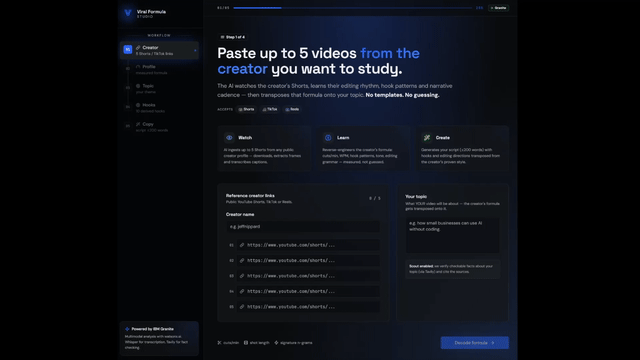

# Viral Formula Studio

**Multimodal reverse engineering of a content creator's viral formula.** Paste up to
5 short-video links (YouTube Shorts, TikTok, Instagram Reels) from any creator and
your topic — the AI watches, learns their technique, and delivers an actionable
shooting script with hooks, editing directions, and retention psychology transposed
to *your* theme, in *your* voice.

> Inspiration, not imitation. Every great creator started by studying someone.
> We hand you the notebook that used to take months to build.

**IBM AI Builders Challenge — July 2026 · "Reimagine Creative Industries with AI"**

🚀 **Live demo:** [bit.ly/viral-studio](https://bit.ly/viral-studio)



---

## Quick Start (Try it in 2 minutes)

The demo comes with **3 pre-analyzed creators** — no uploads needed:

1. Open **[bit.ly/viral-studio](https://bit.ly/viral-studio)**
2. Creator name: type **`jeffnippard`**
3. Paste a Shorts link (any from [@jeffnippard](https://youtube.com/@jeffnippard)) or skip — the seed data is ready
4. Your topic: type anything, e.g. **`carnivore diet`**
5. Click **"Decode formula"** → instant profile from cache
6. Click **"Generate 10 hooks"** → pick one
7. Click **"Generate script"** → see the full shooting script with timestamps, shot types, and editing directions

> 💡 Want a different topic? Click **"New Topic"** — same creator, new theme, zero re-analysis.

---

## Use Cases

- **Content Creators:** Copy winning strategies from creators in your niche — hooks, pacing, editing rhythm
- **Marketing Teams:** Reverse-engineer viral campaigns and adapt them to your brand voice
- **Influencer Agencies:** Analyze client competitors and generate data-backed scripts in minutes
- **Course Creators:** Study how top educators capture attention and convert viewers
- **Social Teams:** Generate 10 variations of hooks from a single creator's pattern

---

## How It Works

```
┌──────────────────────┐     ┌─────────────────────────────────┐     ┌──────────────────────┐
│       INPUT          │     │           PIPELINE               │     │       OUTPUT         │
├──────────────────────┤     ├─────────────────────────────────┤     ├──────────────────────┤
│ YouTube Shorts       │ ──▶ │ ① yt-dlp download + transcribe  │ ──▶ │ Creator profile      │
│ TikTok               │     │ ② ffmpeg cuts / WPM / n-grams   │     │ 10 AI hooks          │
│ Instagram Reels      │     │ ③ Granite 4 text style analysis │     │ Shooting script      │
│                      │     │ ④ Llama Vision reads frames      │     │ Editing directions   │
│                      │     │ ⑤ Tavily fact-checks topic       │     │ Retention psychology │
│                      │     │ ⑥ Granite 4 writes final copy    │     │                      │
└──────────────────────┘     └─────────────────────────────────┘     └──────────────────────┘
```

**Example flow:** Creator → Profile → Topic → 10 Hooks → Pick Hook → Copy → Report

**Transcription pipeline:**

```
Raw captions → regex cleanup (HTML entities, contractions) → Granite 4 coherence fix
```

Every output is grounded in **measured evidence**:
- **Stage 0 — MEASURE (no AI):** ffmpeg computes cuts/min, shot length, words/min, n-grams
- **Stage 1 — EVIDENCE (cached):** Granite 4 decodes text style + vision model reads frames
- **Stage 2 — SCOUT:** Tavily + Granite 4 verify facts about the topic with source URLs
- **Stage 3 — COMMENTATOR:** Granite 4 synthesizes a shooting script with timestamps, shot types, editing directions, and retention psychology

---

## Tech Stack

| Layer | Technology |
|---|---|
| AI Runtime | IBM watsonx.ai (Granite 4 + Llama 3.2 Vision) |
| Backend | Python 3.12, FastAPI, Pydantic, Agno 2.7 |
| Frontend | React 19, Vite, TanStack Start, Tailwind 4, shadcn/ui |
| Transcription | Groq Whisper Large v3 Turbo |
| Media | ffmpeg/ffprobe (scene detection, frame sampling) |
| Ingestion | yt-dlp (YouTube Shorts, TikTok, Instagram Reels) |
| Fact-Check | Tavily Search API |
| Hosting | IBM Cloud Code Engine (serverless containers) |
| CI/CD | GitHub Actions → Docker Hub → Code Engine |
| Testing | pytest (25 tests), ruff |
| Responsive | Mobile-first design — works on phones, tablets, and desktop |

---

## Built on IBM Cloud

This project runs end-to-end on the **IBM Cloud ecosystem**:

<table width="100%">
  <thead>
    <tr>
      <th width="25%">Service</th>
      <th width="55%">Role</th>
      <th width="20%">Region</th>
    </tr>
  </thead>
  <tbody>
    <tr>
      <td><strong>IBM watsonx.ai</strong></td>
      <td>Primary AI — Granite 4 powers all text generation (analysis, hooks, copy)</td>
      <td>us-south (Dallas)</td>
    </tr>
    <tr>
      <td><strong>IBM watsonx.ai</strong></td>
      <td>Multimodal AI — Llama 3.2 11B Vision reads video frames for editing analysis</td>
      <td>us-south (Dallas)</td>
    </tr>
    <tr>
      <td><strong>IBM Cloud Code Engine</strong></td>
      <td>Serverless hosting — two containerized apps (API + Web)</td>
      <td>us-south (Dallas)</td>
    </tr>
    <tr>
      <td><strong>IBM Container Registry</strong></td>
      <td>Docker images built by CI/CD pipeline</td>
      <td>us-south (Dallas)</td>
    </tr>
    <tr>
      <td><strong>IBM Bob</strong></td>
      <td>AI-powered development assistant — architecture, implementation, debugging</td>
      <td>—</td>
    </tr>
  </tbody>
</table>

### AI Models

<table width="100%">
  <thead>
    <tr>
      <th width="25%">Stage</th>
      <th width="55%">Model</th>
      <th width="20%">Runs On</th>
    </tr>
  </thead>
  <tbody>
    <tr>
      <td>🎤 Transcription</td>
      <td>Whisper Large v3 Turbo</td>
      <td>Groq</td>
    </tr>
    <tr>
      <td>📊 Metrics</td>
      <td>Python + ffmpeg (deterministic, no AI)</td>
      <td>IBM Code Engine</td>
    </tr>
    <tr>
      <td>✍️ Text Analysis</td>
      <td><strong>Granite 4</strong> (<code>ibm/granite-4-h-small</code>)</td>
      <td>IBM watsonx.ai</td>
    </tr>
    <tr>
      <td>👁️ Visual Analysis</td>
      <td>Llama 3.2 11B Vision</td>
      <td>IBM watsonx.ai</td>
    </tr>
    <tr>
      <td>🔍 Fact-Check</td>
      <td><strong>Granite 4</strong> + Tavily</td>
      <td>IBM watsonx.ai</td>
    </tr>
    <tr>
      <td>📝 Hooks & Copy</td>
      <td><strong>Granite 4</strong></td>
      <td>IBM watsonx.ai</td>
    </tr>
    <tr>
      <td>🛡️ Fallback</td>
      <td>GPT-4o</td>
      <td>OpenAI</td>
    </tr>
  </tbody>
</table>

Granite 4 (`ibm/granite-4-h-small`) is the **single voice** of the product.
Every sentence the user reads — from the creator's style fingerprint to the final
video script — is generated by Granite on watsonx.ai.

**OpenAI GPT-4o** is configured only as an automatic safety net: if watsonx
experiences rate limits or an outage, agents transparently fall back to OpenAI.
In normal operation, all AI traffic goes through IBM watsonx.

---

## Honesty by Design

- **Measured, not guessed** — the AI interprets deterministic ffmpeg numbers
- **Ground truth injection** — synthesis only receives extracted profiles and verified facts
- **Honesty rules** — every prompt requires `evidence_notes`, `unconfirmed`, and `[INSERT: ...]` placeholders
- **Graceful degradation** — no captions → Whisper; no search → structural mode; provider down → fallback

### Any Creator, Any Language

The pipeline masters creators from any country, in any language:

- **Transcription:** Whisper Large v3 handles 99+ languages. YouTube auto-captions tried first.
- **Text analysis:** Granite 4 reads native-language transcriptions and extracts universal style patterns.
- **Visual analysis:** Editing grammar is language-independent — the vision model reads frames.
- **Output:** Analysis in English, creator's expressions preserved in original.

### Security & Rate Limiting

- **IP-based rate limiting:** max 8 new creator analyses + 8 dossier exports per IP/hour
- **Seed creators** (Bryan, jeffnippard, kallaway) are exempt — unlimited demo usage
- **WatsonX token cap:** `max_tokens=4096` prevents structured JSON truncation
- **Resilient parsing:** `studio/parse.py` recovers Pydantic output from raw/fenced/truncated JSON

---

## Running Locally

```bash
git clone https://github.com/CostaJr007/viral-formula-studio.git
cd viral-formula-studio
uv sync
```

Create `.env` from `.env.example`:

```bash
MODEL_PROVIDER=watsonx
IBM_WATSONX_API_KEY=your_key
IBM_WATSONX_PROJECT_ID=your_project
IBM_WATSONX_URL=https://us-south.ml.cloud.ibm.com
WATSONX_MODEL_ID=ibm/granite-4-h-small
OPENAI_API_KEY=your_key             # fallback only
GROQ_API_KEY=your_key               # transcription
TAVILY_API_KEY=your_key             # fact-checking
```

```bash
uv run python api.py                      # Backend → http://localhost:8000
cd frontend && npm install && npm run dev # Frontend → http://localhost:3000
```

## Project Structure

```
studio/
├── config.py          # pydantic-settings: keys, paths, provider switch
├── factory.py         # ONLY place that knows the LLM provider + fallback
├── schemas.py         # Pydantic contracts (CreatorStyle, EditingProfile, etc.)
├── limits.py          # IP rate limiter (8 creators/IP + 8 dossiers/creator)
├── parse.py           # Resilient structured-output recovery (JSON → Pydantic)
├── store.py           # JSON persistence (transcripts, cached profiles)
├── ingest.py          # Link ingestion: yt-dlp, captions-first, Whisper fallback
├── transcribe.py      # Transcription pipeline + LLM coherence fix
├── frames.py          # ffmpeg frame sampling (480p, uniform)
├── metrics.py         # Deterministic: cuts/min, WPM, n-grams (no LLM)
├── analyze_text.py    # Agent: transcripts + metrics → CreatorStyle
├── analyze_visual.py  # Agent: frames + metrics → EditingProfile (multimodal)
├── research.py        # Agent: web fact-check → ResearchReport
├── dossier.py         # Agent: profiles + facts → viralization playbook
├── create.py          # Guided flow: 10 hooks → pick → shooting script
└── pipeline.py        # Per-creator orchestration (runs once, cached)
api.py                 # FastAPI backend (production)
app.py                 # Gradio UI (quick local demos)
main.py                # Terminal CLI
frontend/              # React 19 + Vite + TanStack Start (5-step wizard)
tests/                 # 25 pytest tests
data/                  # Transcripts + cached creator profiles
```

## Testing

```bash
uv run pytest          # 25 tests (no API keys needed)
uv run ruff check .    # lint
```

## API Endpoints

| Endpoint | Purpose |
|---|---|
| `GET /api/health` | Health check — returns active provider (`watsonx`) |
| `GET /api/creators` | List analyzed creators |
| `POST /api/ingest` | Start analysis (5 URLs → job) |
| `GET /api/jobs/{id}` | Poll analysis progress |
| `GET /api/profile/{creator}` | Cached creator profile (survives restarts via frontend cache) |
| `POST /api/hooks` | Generate 10 hooks in creator's style |
| `POST /api/copy` | Generate shooting script with timestamps + directions |
| `POST /api/dossier` | Export viralization playbook |
| `GET /api/usage` | Rate limit status |

## License

© 2026 Costa Jr. All rights reserved. Shared publicly for review as part of the
IBM AI Builders Challenge (July 2026).
