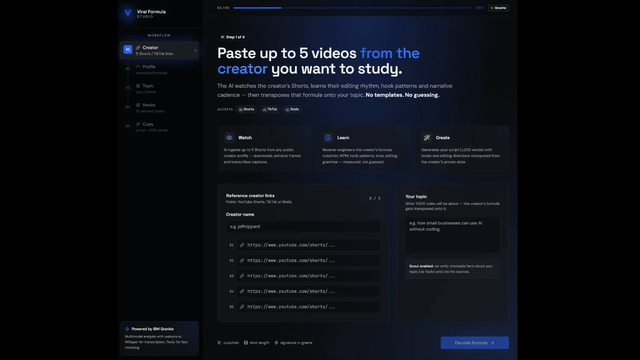

# Viral Formula Studio

**Multimodal reverse engineering of a content creator’s viral formula — measured first, then interpreted by AI.**

Most “AI for creators” tools do this: *paste a topic → model invents hooks and scripts*.  
We do the opposite: **ffmpeg + Python measure real videos** (cuts/min, shot length, WPM, n-grams). Those numbers — plus style and editing profiles — become a **structured evidence pack** the LLM must follow. The model does not invent “fast cuts”; it **interprets measured context** and **transposes** the formula to *your* topic, in *your* voice.

> **Inspiration, not imitation.** The notebook that used to take months to build — without cloning the influencer’s words.

| | |
|---|---|
| **Live demo** | [vfs-web.2cfhg08pznl4.us-south.codeengine.appdomain.cloud](https://vfs-web.2cfhg08pznl4.us-south.codeengine.appdomain.cloud) |
| **API** | `https://vfs-api.2cfhg08pznl4.us-south.codeengine.appdomain.cloud` |
| **Challenge** | IBM AI Builders · July 2026 · *Reimagine Creative Industries with AI* |
| **Hosting** | IBM Cloud Code Engine (us-south) |
| **Repo** | [CostaJr007/viral-formula-studio](https://github.com/CostaJr007/viral-formula-studio) |
| **Built by** | [Adeilson Costa Jr · LinkedIn](https://www.linkedin.com/in/adeilsoncostajr/) |



**IBM stack:** watsonx.ai (Granite 4 + Llama 3.2 Vision) · Code Engine · Container Registry · **IBM Bob** (architecture & ship partner)

---

## Challenge fit (July — Creative Industries)

Judges score **technical execution, innovation, challenge fit, implementation, feasibility**. How this project maps:

| Criterion | How we hit it |
|-----------|----------------|
| **Creative industries** | Tool for short-form creators: reverse-engineer *what works*, then produce hooks + a shoot-ready call sheet — not a generic chatbot |
| **Innovation** | **Deterministic-first pipeline**: measure before any LLM; multimodal (metrics + text + vision); honesty placeholders when facts are missing |
| **Technical execution** | Modular `studio/` engine, Pydantic structured outputs, rate limits, seed cache, pytest suite, live Code Engine deploy |
| **Implementation** | End-to-end product: React wizard + FastAPI + ffmpeg + provider factory (watsonx primary path in code) |
| **Feasibility** | Working prototype online; pre-analyzed seed creators so judges decode in seconds; fallbacks when Lite quota fails |

**What we are *not*:** another prompt wrapper that asks an LLM to “write viral scripts like [creator]” from vibes alone.

---

## For judges (2 minutes)

Seed creators are **pre-analyzed** (metrics + style + editing already on disk). Decode loads the **cache** — no re-download, no re-ffmpeg.

1. Open the **[live demo](https://vfs-web.2cfhg08pznl4.us-south.codeengine.appdomain.cloud)**
2. Enter **your topic** on a seed card → **Decode formula** (**jeffnippard** / **kallaway** / **rourkeheath**)
3. Review the **measured** profile (cuts/min, WPM, shot length, style, editing grammar)
4. **Generate 10 hooks** → pick one  
5. **Write script** → shooting report (spoken copy + timeline + export `.md`)

Optional: system/light/dark theme · **New topic** reuses the same formula · custom Shorts under *Or analyze your own creator*.

> **Cold start:** free-tier Code Engine may scale to zero (~20–90s first hit). After that, seed Decode is a cache read. Use **min-scale 1** on pitch day.

---

## Why this is different (the product thesis)

### Generic AI copy tools

```
User topic + vague prompt  →  LLM  →  generic hooks/script
                                 ↑
                    prior knowledge + hallucination risk
                    (“this creator uses fast cuts” — never measured)
```

### Viral Formula Studio

```
Real videos
  → INGEST       yt-dlp download
  → SPEECH       YouTube captions first · Whisper fallback (Groq/OpenAI)
  → CLEAN        regex cleanup · optional LLM polish · quality gate
  → STORE        data/transcriptions.json (speech) + videos/ (files)
  → MEASURE      ffmpeg + Python (cuts/min, shot length, WPM, n-grams) — no AI
  → EVIDENCE     Granite reads transcripts · Vision reads frames
  → PROFILE      slim Pydantic/JSON the model must follow
User topic
  → SCOUT        Tavily facts (cited)
  → CREATE       hooks + shoot-ready script (evidence-guided, honesty rules)
```

| Principle | What we do |
|-----------|------------|
| **Measured, not guessed** | cuts/min, shot length, WPM, signature n-grams **before** any generation |
| **Speech before style** | Captions or Whisper → cleaned text → then Granite interprets real words |
| **Context the LLM understands** | Compact Pydantic/JSON profile (metrics + hook patterns + editing grammar) injected into prompts — not a wall of free text |
| **Multimodal evidence** | Transcripts → style · frames → editing · metrics stay ground truth |
| **Transpose, don’t clone** | Same *technique*, your *topic* and voice |
| **Honesty by design** | `evidence_notes`, `unconfirmed`, `[INSERT: …]` when facts are missing |
| **Ship-ready** | Live demo, seed cache, rate limits, mobile-friendly UI |

Deep dive: [docs/INNOVATION.md](docs/INNOVATION.md)

---

## How it works

Data is treated in a fixed order: **download → speech → clean → measure → LLM evidence → create**.  
The LLM never invents cuts or WPM; it only interprets numbers and cleaned transcripts.

```
INPUT                              DATA PIPELINE                                   OUTPUT
─────                              ─────────────                                   ──────
Seed creator (cached)  ──┐
  or                     │
1–5 Shorts / links       ├──▶  0 INGEST      yt-dlp → videos/<creator>/
+ your topic           ──┘     1 SPEECH      captions (free) ──else──▶ Whisper
                               2 CLEAN       regex + optional polish + speech gate
                               3 STORE       transcriptions.json (incremental)
                               4 MEASURE     ffmpeg + Python (no AI) ──▶ metrics
                               5 EVIDENCE    style (Granite) ∥ vision (Llama)
                               6 SCOUT       Tavily (topic facts, cited)
                               7 CREATE      hooks + copy (evidence-guided)
                                                                          ──▶ Profile
                                                                          ──▶ 10 hooks
                                                                          ──▶ Shooting script
                                                                          ──▶ Call-sheet report
```

**Speech path (stage 1–2):** prefer free YouTube/auto captions when available; if missing or too short, extract audio with ffmpeg and run **Whisper** (`whisper-large-v3-turbo` on Groq, or `whisper-1` on OpenAI). Then clean artifacts (HTML entities, broken contractions), optionally polish with the same LLM factory, and **reject** empty/error blobs so only usable speech reaches Granite.

**Product defaults (short-form):** ~**170–200** spoken words · **~60–90s** · **6–9** timeline blocks.

### Pipeline stages (data treatment + specialized evidence)

| # | Stage | Role | Engine / store |
|---|-------|------|----------------|
| 0 | **Ingest** | Download short-form video from links | yt-dlp → `videos/<creator>/` |
| 1 | **Speech** | Spoken words as text | YouTube captions **first**; **Whisper** fallback (Groq / OpenAI) |
| 2 | **Clean** | Fix caption/Whisper noise; drop unusable text | Regex cleanup · optional LLM polish · quality gate (`studio/ingest.py`) |
| 3 | **Store** | Persist speech for metrics + style | `data/transcriptions.json` |
| 4 | **Measure** | Cuts/min, shot length, WPM, n-grams | ffmpeg + Python (`studio/metrics.py`) — **no LLM** |
| 5a | **Textual analyst** | Tone, hooks, copy structure from **real transcripts** | **Granite 4** (watsonx) · `analyze_text.py` |
| 5b | **Visual editor** | Editing grammar from frames | Llama 3.2 Vision (watsonx) · `analyze_visual.py` |
| 6 | **Scout** | Verified facts about **your topic** | Tavily (cached per theme) |
| 7a | **Hook strategist** | 10 hooks + quality filter | Guided by measured profile |
| 7b | **Script director** | Call-sheet + length repair/trim | Guided by measured profile + facts |
| — | **Fallback chain** | Keep demo alive on quota errors | watsonx 2nd model → Groq → optional OpenAI |

```
                     ┌─ captions OK ──────────────────────┐
video file ──▶ speech branch                              ├──▶ CLEAN ──▶ STORE
                     └─ no / short captions ──▶ Whisper ──┘         │
                                                                    ▼
                                                         transcripts.json
                                                                    │
                              frames + audio ──▶ MEASURE (ffmpeg, no AI)
                                                    │
                         ┌──────────────────────────┼──────────────────────────┐
                         ▼                          ▼                          ▼
                   style (Granite 4)          editing (Llama Vision)      metrics pack
                   ← real transcripts         ← sampled frames            ← ground truth
                         │                          │                          │
                         └──────────────────────────┴──────────────────────────┘
                                                    ▼
                                         CreatorProfile (JSON)
                                                    │
                              topic ──▶ Scout ──▶ CREATE (hooks + script)
```

**Architecture rule:** provider switch lives only in `studio/factory.py`. Code path supports **watsonx as primary** for submission; live env may use OpenAI/Groq when Lite tokens are exhausted (see footnote). Whisper keys: `GROQ_API_KEY` (preferred) or `OPENAI_API_KEY`.

### Quality without inventing “agents for agents”

- Captions/Whisper → clean speech **before** any style model sees the text
- Slim measured profile into prompts (metrics + formula only — higher signal for the LLM)
- Hook post-filter (drop garbage / near-dupes) + pad to 10
- Copy: word budget, hook alignment, hard cap ~200 spoken words
- Parallel style/vision after metrics · shared research cache for hooks + script

---

## Built on IBM Cloud

| Component | Service |
|-----------|---------|
| Language + vision | **IBM watsonx.ai** — Granite 4 + Llama 3.2 Vision |
| Hosting | **IBM Cloud Code Engine** — `vfs-api` + `vfs-web` (serverless containers) |
| Containers | **Docker** — root `Dockerfile` (API + ffmpeg) + `frontend/Dockerfile` (web) |
| CI/CD | **GitHub Actions** — `docker-publish.yml` (Buildx → Docker Hub) |
| Registry | Docker Hub images (`vfs-api` / `vfs-web`) → Code Engine runtime |
| Build partner | **IBM Bob** — modular engine, deploy, structured outputs |

| App | Role | Notes |
|-----|------|--------|
| `vfs-api` | FastAPI + ffmpeg | Multi-stage-ready image · seeds in image · env secrets |
| `vfs-web` | React UI | `VITE_API_URL` baked at **image build** time |

Deploy guides: [docs/deployment/DEPLOY_IBM.md](docs/deployment/DEPLOY_IBM.md) · [docs/deployment/DEPLOY.md](docs/deployment/DEPLOY.md)

### DevOps & delivery (why this ships, not just demos)

Hackathon demos die when they only run on one laptop. This project is built as a **containerized, CI-backed product path**:

```
git push (main)
    → GitHub Actions (docker-publish)
        → Docker Buildx
            → push vfs-api:latest + vfs-web:latest (Docker Hub)
                → IBM Cloud Code Engine pulls / rebuilds from Dockerfile
                    → live demo + API (us-south)
```

| Practice | What we do | Where |
|----------|------------|--------|
| **Containerize** | API image with Python 3.12, `ffmpeg`, `uv`, seeds; web image for React preview | `Dockerfile`, `frontend/Dockerfile`, `.dockerignore` |
| **CI build & push** | On relevant `main` changes: checkout → Docker login → Buildx → push with GHA cache | `.github/workflows/docker-publish.yml` |
| **Cloud run** | Two Code Engine apps, ports 8000 / 4173, min-scale 0 (free tier) / 1 on pitch day | [DEPLOY_IBM.md](docs/deployment/DEPLOY_IBM.md) |
| **Config as secrets** | API keys and origins via env (never committed) | `.env.example`, Code Engine env vars |
| **Reproducible deps** | Locked Python deps (`uv.lock`) inside image (`uv sync --frozen`) | `pyproject.toml`, `uv.lock` |
| **Health / smoke** | Live `GET /api/health` + creators/profile checks documented | Production status below |
| **Quality gates** | `pytest` + `ruff` without live keys for local/CI-friendly checks | `tests/`, Tech stack |

**Not claimed (honest scope):** no Kubernetes cluster, no Terraform/IaC monorepo, no multi-region mesh. The DevOps surface is the right size for a solo hackathon product: **Docker → Actions → registry → Code Engine**.

### Production status (live smoke)

| Check | Expected |
|-------|----------|
| `GET /api/health` | `status=ok`, `build` present |
| `GET /api/creators` | **jeffnippard**, **kallaway**, **rourkeheath** (profiles + metrics) |
| `GET /api/profile/{seed}` | metrics + style + editing (+ audience snapshot) |
| Seed Decode | **Cache load** — no full re-measure UI |
| Web UI | Wizard, topic on seed cards, social follower badge, theme toggle |

```bash
curl -s https://vfs-api.2cfhg08pznl4.us-south.codeengine.appdomain.cloud/api/health
curl -s https://vfs-api.2cfhg08pznl4.us-south.codeengine.appdomain.cloud/api/creators
```

**Pitch checklist:** min-scale 1 if possible · public YouTube Shorts for custom ingest · seeds unlimited under rate limits · first hit may cold-start.

---

## Tech stack

| Layer | Stack |
|-------|--------|
| AI | watsonx.ai · Agno · structured Pydantic outputs |
| API | Python 3.12 · FastAPI · uvicorn |
| UI | React 19 · Vite · TanStack Start · Tailwind 4 · shadcn/ui |
| Media | yt-dlp · ffmpeg · captions-first speech · Whisper fallback · transcript clean/store |
| Facts | Tavily |
| **Containers** | **Docker** (API + web images) · `.dockerignore` · ffmpeg/nodejs in API image |
| **CI/CD** | **GitHub Actions** · Docker Buildx · Docker Hub publish · build cache (GHA) |
| **Cloud / ops** | **IBM Cloud Code Engine** · env secrets · health endpoints · cold-start aware min-scale |
| Package mgmt | uv (`uv.lock`) · npm (frontend) |
| Tests | pytest (no live keys) · ruff |

---

## Run locally

```bash
git clone https://github.com/CostaJr007/viral-formula-studio.git
cd viral-formula-studio
uv sync
cp .env.example .env   # fill keys — never commit .env
```

```env
MODEL_PROVIDER=watsonx
IBM_WATSONX_API_KEY=
IBM_WATSONX_PROJECT_ID=
IBM_WATSONX_URL=https://us-south.ml.cloud.ibm.com
WATSONX_MODEL_ID=ibm/granite-4-h-small
WATSONX_FALLBACK_MODEL_ID=meta-llama/llama-3-3-70b-instruct
WATSONX_VISION_MODEL_ID=meta-llama/llama-3-2-11b-vision-instruct
OPENAI_FALLBACK=false
OPENAI_API_KEY=
GROQ_API_KEY=            # Whisper + optional LLM fallback
GROQ_LLM_FALLBACK=true
TAVILY_API_KEY=
```

```bash
uv run python api.py                       # http://localhost:8000
cd frontend && npm install && npm run dev  # http://localhost:3000
curl -s http://localhost:8000/api/health
uv run pytest
```

---

## Project structure

```
studio/                 # Engine: ingest → speech → clean → measure → evidence → create
  ingest.py             # Links → download · captions / Whisper · clean · store
  transcribe.py         # ffmpeg audio extract · Whisper API (Groq / OpenAI)
  metrics.py            # Deterministic measurements (no LLM)
  analyze_text.py       # Granite: style from real transcriptions
  analyze_visual.py     # Vision: editing from frames
  factory.py            # Provider switch + fallbacks
  create.py · research.py · …
api.py                  # FastAPI production API
frontend/               # 5-step wizard (seeds, mobile, theme)
data/transcriptions.json  # Cleaned speech per creator/video
data/profiles/          # Seed creators (pre-measured demos)
tests/                  # pytest — including seed contract tests
docs/                   # Innovation + deploy
```

### API (summary)

| Method | Path | Purpose |
|--------|------|---------|
| GET | `/api/health` | Status + provider + build |
| GET | `/api/creators` | Seed / listed creators |
| GET | `/api/profile/{creator}` | Cached measured profile |
| POST | `/api/hooks` | 10 hooks (profile + topic) |
| POST | `/api/copy` | Script (`blocks`, `spoken_copy`, word count) |
| POST | `/api/ingest` | Custom URLs → async analyze job |
| GET | `/api/jobs/{id}` | Job poll |
| POST | `/api/dossier` | Full markdown playbook |

---

## Documentation

| Doc | Contents |
|-----|----------|
| [docs/INNOVATION.md](docs/INNOVATION.md) | Why measured + multimodal + IBM |
| [docs/deployment/DEPLOY_IBM.md](docs/deployment/DEPLOY_IBM.md) | Code Engine deploy |
| [AGENTS.md](AGENTS.md) | Contributor / agent rules |

---

## How IBM Bob was used

Bob was a **spec-driven build partner**, not a black-box dump:

- Modular `studio/` engine and provider factory
- Structured-output recovery and script normalization
- Code Engine deploy, CORS, free-tier constraints
- Test suite for metrics/schemas/seeds without live LLM keys

Product decisions and honesty rules remain human-owned.

---

## License

© 2026 [Adeilson Costa Jr](https://www.linkedin.com/in/adeilsoncostajr/). All rights reserved.  
Shared publicly for review as part of the **IBM AI Builders Challenge (July 2026)** — *Reimagine Creative Industries with AI*.  
**Contact:** [linkedin.com/in/adeilsoncostajr](https://www.linkedin.com/in/adeilsoncostajr/)

---

\* Live demo may run on OpenAI/Groq when **watsonx Lite tokens are exhausted**. The architecture and code still treat **IBM watsonx (Granite + Vision)** as the primary submission stack via `MODEL_PROVIDER=watsonx`.
